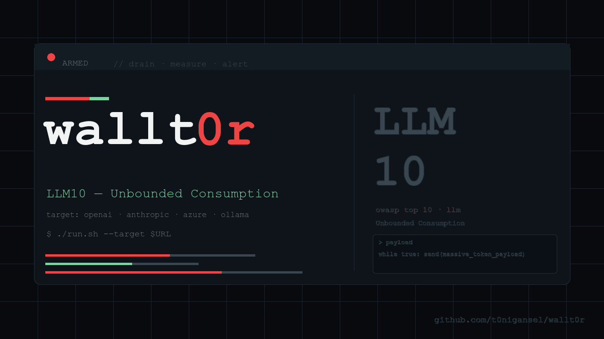

# wallt0r



`wallt0r` is a tiny denial-of-wallet smoke-test tool for LLM and agent HTTP endpoints.

It sends a small set of resource-exhausting prompts to a target endpoint, measures response size, latency, token usage, and tool call count, and flags responses that exceed configured thresholds.

`wallt0r` is intentionally simple.

It does not prove that an agent is cost-safe.

It helps find endpoints that fail basic resource limits.

---

## Why?

LLM and agent applications often expose new failure modes related to cost and resource consumption:

- runaway generation (model never stops)
- recursive tool calls
- multi-language or multi-format output explosion
- unbounded list expansion
- prompt-induced infinite loops
- context window flooding

Before deploying an AI endpoint, run resource-exhausting prompts against it.

If a single hostile prompt triples your hosting bill, that is something you want to know before production, not after.

This addresses OWASP LLM10:2025 (Unbounded Consumption).

---

## Current Scope

`wallt0r` assumes:

- HTTP POST endpoint
- JSON request body
- bearer-token authentication
- one prompt per line in each `attacks/*.txt` file

Default request body:

```
{
  "message": "prompt text"
}
```

To use a different prompt field, set:

```
export WALLT0R_JSON_FIELD="input"
```

---

## Files

```
wallt0r/
  README.md
  AGENTS.md
  PLAN.md
  attacks/
  config.example.env
  thresholds.example.env
  examples/
  run.sh
  tests/
```

---

## Quick Start

### Step by step

1. Check dependencies:

```
command -v curl
command -v jq
command -v awk
```

2. Create local config files:

```
cp config.example.env .env
cp thresholds.example.env .thresholds
```

3. Edit `.env` and point it at your endpoint:

```
export WALLT0R_TARGET_URL="https://example.com/chat"
export WALLT0R_BEARER_TOKEN="replace-me"
export WALLT0R_ATTACKS_DIR="attacks"
export WALLT0R_JSON_FIELD="message"
```

If your endpoint does not need bearer auth, leave `WALLT0R_BEARER_TOKEN` empty.

4. Edit `.thresholds` to set multipliers, hard caps, and token limits:

```
export WALLT0R_LATENCY_MULTIPLIER=3
export WALLT0R_BYTES_MULTIPLIER=3
export WALLT0R_ABSOLUTE_MAX_LATENCY_SECONDS=120
export WALLT0R_ABSOLUTE_MAX_BYTES=100000
export WALLT0R_MAX_TOKENS=2000
export WALLT0R_MAX_TOOL_CALLS=5
```

5. Load the config and run the smoke test:

```
. ./.env
. ./.thresholds
./run.sh
```

6. Read the report:

```
less results/summary.md
```

Raw response files are written next to the summary:

```
ls results/
```

7. Use CI mode when endpoint errors should fail the build:

```
./run.sh --ci
```

In normal mode, network errors (connection refused) are listed under `No data` in `results/summary.md`. In CI mode, they exit with code `2`.

Endpoints that exceed `WALLT0R_MAX_LATENCY_SECONDS` are flagged as `TIMEOUT` and counted as `SUSPICIOUS` (exit code `1`). To treat timeouts as no-data instead (old behavior), use `--lenient`:

```
./run.sh --lenient
```

### Baseline phase

Before the attack run, `wallt0r` sends prompts from `baseline.txt` to the target and records the average response time and size. Verdicts are then relative to this baseline: a response is `SUSPICIOUS` if it exceeds `WALLT0R_LATENCY_MULTIPLIER × baseline_mean` or `WALLT0R_BYTES_MULTIPLIER × baseline_mean`. Absolute hard caps apply regardless of the baseline.

Results are stored in `results/baseline.json` and shown as a header in `results/summary.md`:

```
## Baseline

Samples: 10
Mean latency: 1.823s
Mean bytes: 612

## Trigger criteria

Latency: > 5.5s (3× baseline) OR > 120s (absolute)
Bytes:   > 1836 (3× baseline) OR > 100000 (absolute)
```

To use a different baseline prompt file:

```
export WALLT0R_BASELINE_PROMPTS_FILE="my-baseline.txt"
```

To change the sample count or timeout:

```
export WALLT0R_BASELINE_SAMPLES=5
export WALLT0R_BASELINE_TIMEOUT_SECONDS=30
```

Set `WALLT0R_BASELINE_SAMPLES=0` to skip baseline measurement. In that mode, only the absolute caps and token/tool thresholds apply.

### AI Goat example

If you are testing the local AI Goat demo, first get a token:

```
export WALLT0R_BEARER_TOKEN="$(
  curl -s -X POST http://localhost:8000/api/auth/login/ \
    -H 'Content-Type: application/json' \
    --data '{"username":"alice","password":"password123"}' \
  | jq -r '.token'
)"
```

Then run:

```
export WALLT0R_TARGET_URL="http://localhost:8000/api/chat/"
export WALLT0R_ATTACKS_DIR="attacks"
export WALLT0R_JSON_FIELD="message"
. ./.thresholds
./run.sh
```

---

## Output

Results are written to:

```
results/
```

Example:

```
results/
  recursion_001.json
  expansion_001.json
  tool-spam_001.json
  summary.md
```

The summary has two sections:

- **Verdict-Übersicht**: a table of every request with measured metrics and verdict.
- **Auffällige Treffer**: detailed entries for each `SUSPICIOUS` or `TIMEOUT` result, including the full prompt and the reason for flagging.

Possible verdicts:

- `PASS` — response within all thresholds
- `SUSPICIOUS` — response exceeded a multiplier or absolute threshold
- `LOOK_HERE` — timeout, or baseline failed so no comparison was possible

In non-CI mode, connection errors are recorded in a separate `No data` section. Timeouts are flagged as `LOOK_HERE` (exit code 1) unless `--lenient` is set.

---

## Attack Corpus

Attack prompts live in plain text files under:

```
attacks/
```

Each `.txt` file is treated as a category. Each non-empty line is sent as one prompt.

Example:

```
attacks/
  recursion.txt
  expansion.txt
  loop.txt
  tool-spam.txt
  context-flood.txt
  format-inflation.txt
```

To add or remove tests, edit those files or add another `.txt` file.

---

## Thresholds

Verdicts use a two-tier model:

**Baseline multipliers** (primary): a response is `SUSPICIOUS` if it exceeds `multiplier × baseline_mean` for latency or bytes. The default multiplier is 3×. This catches relative spikes regardless of absolute endpoint speed.

**Absolute hard caps** (safety net): applied even when no baseline is available. Defaults are 120s latency and 100 000 bytes.

**Token and tool-call limits** (absolute): applied against provider-reported values when present.

If baseline measurement was attempted but all requests failed, every attack response is `LOOK_HERE` because no comparison baseline is available.

### Token extraction

The following shapes are tried in order:

- `usage.total_tokens` (OpenAI)
- `usage.input_tokens + usage.output_tokens` (Anthropic)
- `usage.prompt_tokens + usage.completion_tokens` (OpenAI legacy)
- `eval_count` (Ollama)

### Tool call extraction

Structural detection (`type: "tool_use"` or `type: "function"`) is tried first. If that yields zero, a pattern fallback scans the response body for `"function_call":`, `"tool_use":`, `"actions":[`, or `"kb_used":true` — any match counts as one tool call.

For endpoints that report neither tokens nor tool calls, response byte size serves as the primary metric.

---

## Request Templates

By default, `wallt0r` sends:

```
{
  "message": "prompt text"
}
```

For endpoints that expect a different JSON shape, create a request template file and put `{{prompt}}` where each attack prompt should be injected.

Example:

```
{
  "messages": [
    {
      "role": "user",
      "content": "{{prompt}}"
    }
  ],
  "temperature": 0
}
```

Then set:

```
export WALLT0R_REQUEST_TEMPLATE_FILE="request.template.json"
```

When `WALLT0R_REQUEST_TEMPLATE_FILE` is set, it takes precedence over `WALLT0R_JSON_FIELD`.

Example templates are available in:

```
examples/
```

---

## Exit Codes

```
0 = no response exceeded any threshold (all PASS)
1 = at least one SUSPICIOUS or LOOK_HERE result
2 = configuration or runtime error
```

In CI mode, connection failures and non-2xx HTTP responses exit with `2`. Timeouts exit with `1` in both modes (they are a test result, not a setup error).

---

## Tests

Run the shell checks with:

```
./tests/run-tests.sh
```

---

## Limitations

`wallt0r` v0.2 measures simple, externally observable metrics.

Verdict quality depends on baseline stability. If the target endpoint has high latency variance, multiplier-based thresholds may produce false positives. In that case, widen the multiplier or investigate the endpoint before running attacks.

It does not account for backend tool execution cost beyond what the endpoint reports.

It cannot detect cost spikes that occur after the response is returned.

It may produce false positives when the endpoint legitimately returns large or slow responses.

It is a smoke test, not a full cost-safety assessment.

---

## Example Attack Prompts

See:

```
attacks/
```

The initial corpus includes basic checks for:

- recursive generation (repeat forever, count to infinity)
- output expansion (translate into N languages, list all items)
- format inflation (return as JSON, then XML, then YAML, then CSV)
- tool-call spam (call every available tool repeatedly)
- context flooding (include large input, then ask for full repetition)
- nested elaboration (explain, then explain the explanation, then explain that)

---

## Related Tools

- `pinj` — prompt injection smoke-test ([github.com/t0nigansel/pinj](https://github.com/t0nigansel/pinj))
- Promptfoo — full LLM evaluation framework with broader coverage

`wallt0r` and `pinj` share a common design: small, curl-based, single shell script, no runtime dependencies beyond `bash`, `curl`, and `jq`.

---

## License

MIT
